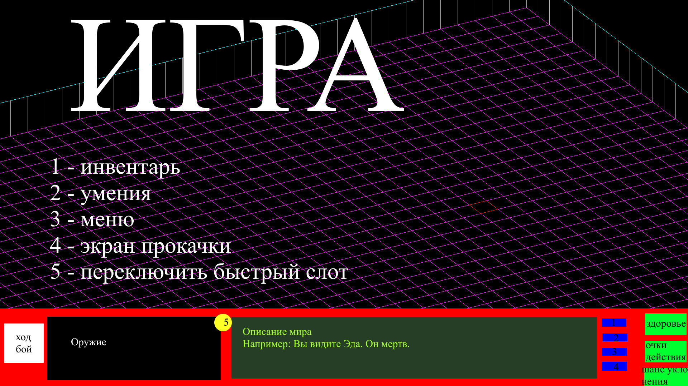

# Техническое задание

1. Project name: The Lost Dungeon

2. Authors:
   - Team Lead: Ситников Никита Андреевич
   - Project Developers: Ситников Никита Андреевич, Бакланова Дарья Сергеевна
   - Teacher: Анатольев Алексей Владимирович

3. Description of the program:
   1) Запуск игры через exe - приложение. На главном меню будет возможность
   начать новую игру, загрузить сохранение и настроить графику.
   2) Игра будет завершена после прохождения компании или смерти персонажа. Финальное окно (после прохождения) будет 
   представлять собой слайд-шоу с рассказом о судьбах основных персонажей игры. В случае смерти будет отрываться главно меню.
   3) Взаимодействия персонажа с элементами игры: возможность подбирать предметы, разговаривать с дружественными персонажами,
   взаимодействовать с объектами (например, открывать двери), возможность вести бой с враждебными персонажами. В таком случае
   сражения будут происходить пошагово (например, как в Fallout 2). Вне боя персонаж может спокойно перемещаться по локации
   Также можно переходить между локациями одного уровня. Перемещение между уровнями будет происходить автоматически, состояние 
   персонажа будет при этом сохраняться.
   4) Персонаж может разговаривать с дружественными персонажами, попытаться у них что-нибудь украсть или атаковать их.
   В ответ ИИ будет атаковать игрока. Так же персонажи могут атаковать игрока первыми (например, при провоцировании в 
   диалоге). Некоторые персонажи будут атаковать персонажа как только его заметят.
   5) Звуковое сопровождение будут индивидуальным для каждого уровня. Также у каждого босса будет свой трек, который 
   будет включаться при сражении с этим боссом. Также во время боя будут воспроизводиться звуки используемого оружия, и звуки попадания.
   6) 1) Планируется создание изометрической игры.
      2) У игры будет несколько концовок.
      3) Будет настройка разрешения экрана.
      4) Будет возможность сохранять игру
4. Project description:
   В игре будет четыре параллельных процесса:
   1) Screen. Будет заниматься отрисовкой графики и обработкой нажатий кнопок, движения мыши и т.д.
   2) Mechanics. Будет заниматься механикой игры: рассчетом боевой системы, рассчетом навыков, короче будет считать.
   3) Level. Будет хранить и считать перемещение сущностей, поведение объектов на карте (например, отрисовкой дверей),
   будет хранить и открывать тайтлы на карте.
   4) AI. Будет управлять ии.
   Очевидно, что для реализации будет использоваться библиотека multiprocessing
   
   
5. Program code plan:
   Константы: Не могу предвидить.
   Функции: AI, Отрисовки, Боевки, Взаимодействия игрока с объектами, Движения, 
   Классы: Сущности, Предметы, Сетка. От "сущности" будут наследоваться "враги", "друзья", а от них - сами сущности. 
   Аналогично с предметами - "оружие", "ингредиенты", "записки", "броня".
   Библиотеки: Multiprocessing, Random.
6. Graphical interface:
   
7. Deadlines:
На данный момент не знаю, т.к. на занятиях не были изучены необходимые элементы, а именно: тайтлы, открытие изображений, AI,
видео, кнопки, триггеры и тд.
   